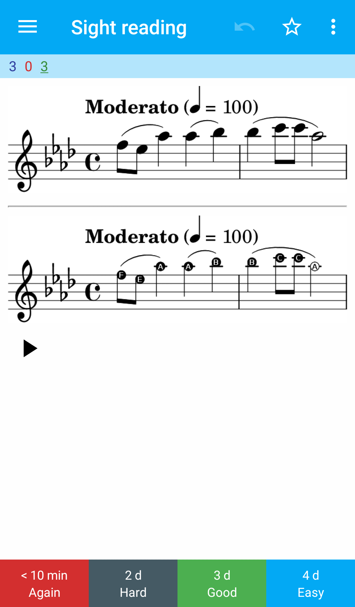

# Usage
This lets you write bits of music in a scheme list in a .ly file, and turn it into an Anki deck with images of sheet music and generated audio. A folder will be created with the same name as your .ly file.

```
./lilyToAnki.sh lilypondFileNameWithoutExtension
```

The output when run is a .apkg file you can import into Anki.

# Requirements
Lilypond, Timidity, and the python3 modules genanki and natsort.

## Details about scripts

lilyToAnki.sh just runs lilypond, then timidity, then anki.py in order.

The important lilypond stuff is all in cardify.ly, so put your music in another file and include cardify in it.

Here's an example of how to structure your music file to use cardify:
```
\include "cardify.ly"

#(define musicList (cardifyMusicList (list 
  #{ \relative c''' {\key aes \major aes( bes) bes( c) aes( ees) } #}
  #{ \relative c''' {\key aes \major aes( bes) bes( c8 c) aes4( ees) } #})))

$@musicList
```

The command below generates all the images for your cards, and midi files to be used later. The folder you specify should exist before you run the command. You can leave it out, but it generates a whole mess of files.

```
lilypond -dpreview -o folderName aLilypondFile.ly
```

Anki doesn't play midi files, so install timidity and use it to convert midi to wav:

```
for i in *.midi; do timidity "$i" -Ow; done
```

anki.py uses genanki and natsort, you'll want to install those with pip.

```
python3 anki.py folderName
```